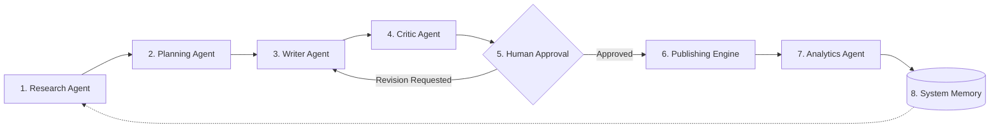

# AI Social Media Automation Platform - System Architecture

## Overview

The **AI Social Media Automation Platform** is an enterprise-grade agentic AI system designed to automate end-to-end social media content creation, review, scheduling, publishing, and analytics.

---

## 1. Currently Implemented Architecture

The codebase currently implements **Phase 1 (Project Foundation)** and **Phase 2 (LLM Service & Provider Abstraction)**.

### 1.1 Foundation & Service Architecture

```mermaid
graph TD
    Client[HTTP Client / API] -->|GET /health| FastAPI[FastAPI App Instance]
    Client -->|GET /api/v1/health| V1Router[Modular API v1 Router]
    FastAPI --> V1Router
    FastAPI --> Config[Centralized Config: pydantic-settings]
    FastAPI --> Logging[Centralized Logging: logging.basicConfig]
    Config --> EnvFile[Environment Variables: .env / .env.example]

    Agent[Future Agent: Research / Writer / Critic] -->|generate / generate_structured| LLMService[Central LLMService]
    LLMService -->|Bounded Retries & Factory| LLMProvider[<<interface>> LLMProvider]
    LLMProvider <|.. GroqProvider[GroqProvider: ChatGroq]
    LLMProvider <|.. FutureProvider[Future Providers: OpenAI / Anthropic]
    Config --> LLMService
```

### 1.2 Core Architectural Principles of the LLM Service Layer

1. **Provider Agnostic**: Agents never instantiate concrete LLM classes (e.g. `ChatGroq`) directly. Instead, agents interact exclusively with the unified `LLMService` interface. This allows seamless switching between LLM backends (e.g. Groq, OpenAI, Anthropic, local vLLM) by changing configuration alone without rewriting any agent code.
2. **Centralized Configuration**: All LLM settings (`GROQ_API_KEY`, `LLM_PROVIDER`, `LLM_MODEL`, `LLM_TEMPERATURE`, `LLM_MAX_RETRIES`) are managed and validated via `pydantic-settings` in `backend/app/config.py`.
3. **Structured Outputs**: Native support for Pydantic schema validation via `llm_service.generate_structured(schema=MySchema, prompt=...)`.
4. **Resilience & Bounded Retries**: `LLMService` incorporates bounded exponential backoff retries for transient upstream provider failures, isolating retry logic from agent-level reasoning loops.
5. **Security & Clean Errors**: API keys and authorization headers are never logged or exposed in error messages. Custom domain exceptions (`LLMConfigurationError`, `LLMProviderError`, `LLMResponseError`, `LLMRetryExhaustedError`) provide clean, actionable failure modes.

### 1.3 Implemented Modules

| Module | Location | Purpose |
|---|---|---|
| **Core App** | `backend/app/main.py` | FastAPI application initialization and lifespan management |
| **Configuration** | `backend/app/config.py` | Type-safe settings with environment variable loading |
| **Logging** | `backend/app/core/logging.py` | Centralized structured logging formatting |
| **Health API** | `backend/app/api/v1/health.py` | Basic liveness and readiness health check endpoints |
| **LLM Interface** | `backend/app/services/llm/base.py` | `LLMProvider` abstract base class defining `generate` & `generate_structured` |
| **LLM Exceptions** | `backend/app/services/llm/exceptions.py` | Hierarchical domain exceptions for configuration, provider, and response errors |
| **Groq Adapter** | `backend/app/services/llm/providers/groq.py` | `GroqProvider` implementing `LLMProvider` via LangChain's `ChatGroq` |
| **LLM Orchestrator** | `backend/app/services/llm/service.py` | `LLMService` with provider registry and bounded backoff retries |

---

## 2. Planned for Future Phases (Not Implemented Yet)

The following components represent future architecture milestones and are **not** yet implemented in Phase 2:

### 2.1 Agentic AI Pipeline (LangGraph)
- **Research Agent**: Scrapes web sources and gathers real-time trend intelligence using search APIs (e.g., Tavily, SerpAPI).
- **Planning Agent**: Formulates content outlines, schedules, angle strategies, and campaign plans.
- **Writer Agent**: Generates platform-specific social copy (Twitter/X threads, LinkedIn posts) leveraging `LLMService`.
- **Critic Agent**: Evaluates generated content for brand alignment, voice consistency, factual accuracy, and policy constraints.
- **Human Approval (Human-in-the-Loop)**: Review dashboard where operators can inspect, edit, approve, or reject draft posts before queueing.



### 2.2 Database & Persistence Layer
- **Phase 3+ Initial**: SQLite with SQLAlchemy and Alembic migrations for local development.
- **Production**: PostgreSQL for high-concurrency multi-tenant operations.

### 2.3 Frontend Application
- React + Vite Single Page Application (SPA) with responsive dashboard, approval queue, analytics visualizers, and agent monitor.

### 2.4 Social Media Integrations & Publishing
- OAuth 2.0 authentications and API integrations for X (Twitter), LinkedIn, and additional platforms.
- Background asynchronous worker queues (Celery / Redis / background tasks) for scheduled content dispatching.
