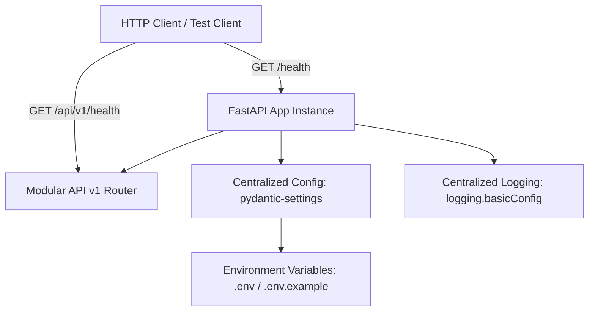
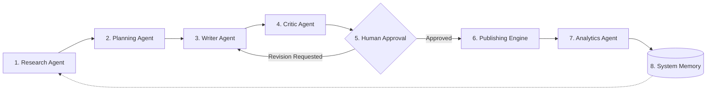

# AI Social Media Automation Platform - System Architecture

## Overview

The **AI Social Media Automation Platform** is an enterprise-grade agentic AI system designed to automate end-to-end social media content creation, review, scheduling, publishing, and analytics.

---

## 1. Currently Implemented (Phase 1: Project Foundation)

The current phase establishes the core backend foundation, configuration management, logging, test infrastructure, and development environment.

### Foundation Components

### Key Technical Details

- **Framework**: FastAPI (Python 3.12)
- **Configuration Management**: `pydantic-settings` (`BaseSettings`) loading typed settings from environment variables and `.env` with cached `get_settings()` accessor.
- **Logging**: Standard library logging centralized in `backend/app/core/logging.py`, configurable via `LOG_LEVEL` (`INFO`, `WARNING`, `ERROR`, `DEBUG`).
- **Routing Structure**:
  - Root route: `GET /health`
  - Modular API router prefix: `/api/v1`
  - Health router: `GET /api/v1/health`
- **Testing**: `pytest` test suite with `httpx` / `TestClient` in `backend/tests/test_health.py`.
- **Environment & Dependency Isolation**: Dedicated `.venv` running Python 3.12 with minimal Phase 1 dependencies.

---

## 2. Planned for Future Phases (Not Implemented Yet)

The following components represent future architecture milestones and are **not** yet implemented in Phase 1:

### 2.1 Agentic AI Pipeline (LangGraph)
- **Research Agent**: Scrapes web sources and gathers real-time trend intelligence using search APIs (e.g., Tavily, SerpAPI).
- **Planning Agent**: Formulates content outlines, schedules, angle strategies, and campaign plans.
- **Writer Agent**: Generates platform-specific social copy (Twitter/X threads, LinkedIn posts) leveraging provider-independent LLMs (Groq, OpenAI, Anthropic).
- **Critic Agent**: Evaluates generated content for brand alignment, voice consistency, factual accuracy, and policy constraints.
- **Human Approval (Human-in-the-Loop)**: Review dashboard where operators can inspect, edit, approve, or reject draft posts before queueing.

### 2.2 Database & Persistence Layer
- **Phase 2+ Initial**: SQLite with SQLAlchemy and Alembic migrations for local development.
- **Production**: PostgreSQL for high-concurrency multi-tenant operations.

### 2.3 Frontend Application
- React + Vite Single Page Application (SPA) with responsive dashboard, approval queue, analytics visualizers, and agent monitor.

### 2.4 Social Media Integrations & Publishing
- OAuth 2.0 authentications and API integrations for X (Twitter), LinkedIn, and additional platforms.
- Background asynchronous worker queues (Celery / Redis / background tasks) for scheduled content dispatching.
