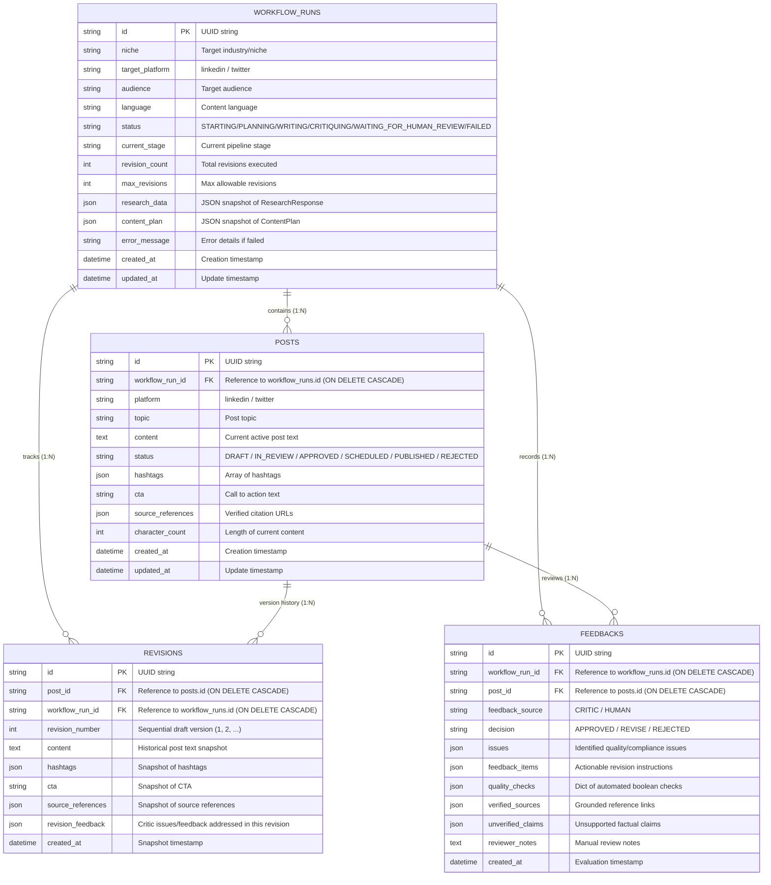

# AI Social Media Automation Platform - System Architecture

## Overview

The **AI Social Media Automation Platform** is an enterprise-grade agentic AI system designed to automate end-to-end social media content creation, review, scheduling, publishing, and analytics.

---

## 1. Currently Implemented Architecture

The codebase currently implements:
- **Phase 1: Project Foundation** (FastAPI core, configuration, logging, health endpoints, pytest)
- **Phase 2: LLM Service Layer** (Provider-agnostic LLM abstraction, Groq adapter, structured output, bounded retries)
- **Phase 3: Research Agent** (Topic discovery, search tool abstraction, Tavily integration, source grounding, trend validation)
- **Phase 4: Planning Agent** (Content strategy formulation, trend evaluation, hook/key-points/CTA design, source grounding)
- **Phase 5: Writer / Generation Agent** (Platform-aware copy generation, plan adherence, length validation, source citation grounding)
- **Phase 6: Critic / Reviewer Agent** (Deterministic quality checks, source grounding verification, structured LLM evaluation, APPROVED/REVISE decision logic)
- **Phase 7: LangGraph Orchestration** (Stateful multi-agent workflow, bounded revision loop, human review checkpoint boundary)
- **Phase 8: Database & Persistence Layer** (SQLAlchemy 2.x async ORM, SQLite/PostgreSQL compatibility, Alembic migrations, Repository pattern)

### 1.1 System Architecture Diagram

```mermaid
graph TD
    Client[HTTP Client / API] -->|GET /health| FastAPI[FastAPI App Instance]
    Client -->|GET /api/v1/health| V1Router[Modular API v1 Router]
    FastAPI --> V1Router
    FastAPI --> Config[Centralized Config: pydantic-settings]
    FastAPI --> Logging[Centralized Logging: logging.basicConfig]
    FastAPI --> Database[Database Session & Engine: session.py]
    Config --> EnvFile[Environment Variables: .env / .env.example]

    subgraph LangGraph Pipeline [Phase 7: Workflow Orchestration]
        START((START)) --> NodeResearch[1. research_node]
        NodeResearch --> NodePlanning[2. planning_node]
        NodePlanning --> NodeWriter[3. writer_node]
        NodeWriter --> NodeCritic[4. critic_node]
        
        NodeCritic --> CondRoute{Decision Router}
        CondRoute -->|decision == APPROVED| NodeHumanReview[5. human_review_node]
        CondRoute -->|decision == REVISE & count < max| NodeWriter
        CondRoute -->|decision == REVISE & count >= max| NodeHumanReview
        
        NodeHumanReview --> END((END: WAITING_FOR_HUMAN_REVIEW))
    end

    NodeResearch --> ResearchAgent[ResearchAgent: Phase 3]
    NodePlanning --> PlanningAgent[PlanningAgent: Phase 4]
    NodeWriter --> WriterAgent[WriterAgent: Phase 5]
    NodeCritic --> CriticAgent[CriticAgent: Phase 6]

    subgraph LLM Service Layer [Phase 2: Provider Agnostic]
        ResearchAgent --> LLMService[LLMService]
        PlanningAgent --> LLMService
        WriterAgent --> LLMService
        CriticAgent --> LLMService
        LLMService --> LLMProvider[<<interface>> LLMProvider]
        LLMProvider <|.. GroqProvider[GroqProvider: ChatGroq]
    end

    subgraph Persistence Layer [Phase 8: SQLAlchemy 2.x & Repositories]
        WorkflowRepo[WorkflowRepository] --> WorkflowRunModel[(workflow_runs)]
        PostRepo[PostRepository] --> PostModel[(posts)]
        PostRepo --> RevisionModel[(revisions)]
        FeedbackRepo[FeedbackRepository] --> FeedbackModel[(feedbacks)]
        WorkflowRunModel -->|1:N Cascade| PostModel
        WorkflowRunModel -->|1:N Cascade| RevisionModel
        WorkflowRunModel -->|1:N Cascade| FeedbackModel
        PostModel -->|1:N Cascade| RevisionModel
        PostModel -->|1:N Cascade| FeedbackModel
    end
```

---

## 2. Agent Responsibilities & Separation of Concerns

The architecture establishes a strict separation between **Domain Intelligence** (Agents), **Flow Coordination** (LangGraph), and **Persistence** (Database):

| Component | Responsibility | Question Answered |
|---|---|---|
| **Research Agent** | Discover trending topics and search evidence from Tavily/Web | *"What is happening right now?"* |
| **Planning Agent** | Formulate content strategy, angle, hook, and key points | *"What content should we build from this?"* |
| **Writer Agent** | Write platform-tailored post copy adhering to strategy | *"How should the post actually be written?"* |
| **Critic Agent** | Validate compliance, citations, quality, and platform constraints | *"Is the post acceptable or does it need revisions?"* |
| **LangGraph Orchestrator** | Manage state transitions, conditional edges, and bounded loops | *"Which agent executes next and when do we terminate?"* |
| **Database & Repositories** | Store workflow runs, posts, historical revision snapshots, and feedback | *"Where are workflow states, post drafts, revisions, and audits preserved?"* |

---

## 3. LangGraph Orchestration & Bounded Revision Loop (Phase 7)

### 3.1 Centralized Workflow State (`SocialWorkflowState`)

The workflow maintains a serializable state dictionary across all nodes:

- `request: ResearchRequest`: Initial user search request and platform target.
- `research: ResearchResponse | None`: Verified trends and raw search evidence from `research_node`.
- `content_plan: ContentPlan | None`: Structured editorial plan from `planning_node`.
- `social_post: SocialPost | None`: Generated or revised social post copy from `writer_node`.
- `critic_result: CriticResult | None`: Quality evaluation result from `critic_node`.
- `revision_feedback: list[str]`: Consolidated feedback passed from Critic to Writer on revisions.
- `revision_count: int`: Current revision cycle count (0-indexed).
- `max_revisions: int`: Configured upper bound on revision iterations (default 2).
- `status: str`: Current lifecycle state (`STARTING`, `PLANNING`, `WRITING`, `CRITIQUING`, `WAITING_FOR_HUMAN_REVIEW`, `FAILED`).
- `human_review_required: bool`: Checkpoint flag indicating readiness for human review.
- `error: str | None`: Error details if any node encounters unhandled exceptions.

### 3.2 Graph Execution Flow & Bounded Revision Logic

```text
START
  ↓
research_node
  ↓
planning_node
  ↓
writer_node ◄───────────────┐
  ↓                         │
critic_node                 │
  ↓                         │ (if REVISE and revision_count < max_revisions)
[Conditional Edge] ─────────┘
  ├── APPROVED                     ──► human_review_node ──► END (WAITING_FOR_HUMAN_REVIEW)
  └── REVISE & count >= max_revisions ──► human_review_node ──► END (WAITING_FOR_HUMAN_REVIEW)
```

1. **Deterministic Bounded Loop**: When the Critic returns `REVISE`, the workflow increments `revision_count` and passes `revision_feedback` back to `writer_node`.
2. **Guaranteed Termination**: If `revision_count >= max_revisions`, the graph bypasses further revision cycles and transitions to `human_review_node`, preventing infinite loops.
3. **Human Review Boundary**: The workflow stops at `WAITING_FOR_HUMAN_REVIEW` without automatic publishing, exposing all intermediate state for a future frontend or human approver.

---

## 4. Database & Persistence Architecture (Phase 8)

### 4.1 Relational Schema & Entity Relationships

The schema is built using **SQLAlchemy 2.x declarative mapped models** with full async support (`aiosqlite` for SQLite development/testing, `asyncpg` for PostgreSQL production):



### 4.2 Repository Pattern Abstraction

- `BaseRepository[T]`: Generic async CRUD operations (`create`, `get_by_id`, `list_all`, `update`, `delete`).
- `WorkflowRepository`: Domain operations for `WorkflowRun` (`get_with_relations`, `get_by_status`, `update_status`).
- `PostRepository`: Operations for `Post` and `Revision` history snapshots (`get_with_revisions`, `get_by_workflow`, `create_revision_snapshot`).
- `FeedbackRepository`: Querying evaluation records (`get_for_post`, `get_for_workflow`).

---

## 5. Implemented Modules Overview

| Subsystem | Module | Purpose |
|---|---|---|
| **Core App** | `backend/app/main.py` | FastAPI application initialization and lifespan management |
| **Configuration** | `backend/app/config.py` | Type-safe settings with environment variable loading |
| **Logging** | `backend/app/core/logging.py` | Centralized structured logging formatting |
| **Health API** | `backend/app/api/v1/health.py` | Basic liveness and readiness health check endpoints |
| **Database Session** | `backend/app/db/session.py` | Async engine creation, session factory, Base declarative class |
| **Workflow ORM** | `backend/app/db/models/workflow.py` | `WorkflowRun` SQLAlchemy model |
| **Post ORM** | `backend/app/db/models/post.py` | `Post` and `Revision` SQLAlchemy models |
| **Feedback ORM** | `backend/app/db/models/feedback.py` | `Feedback` evaluation & audit SQLAlchemy model |
| **Repositories** | `backend/app/db/repositories/` | Generic `BaseRepository`, `WorkflowRepository`, `PostRepository`, `FeedbackRepository` |
| **Migrations** | `backend/alembic/` | Alembic async database migrations configuration and initial schema |
| **LLM Interface** | `backend/app/services/llm/base.py` | `LLMProvider` abstract base class defining `generate` & `generate_structured` |
| **LLM Exceptions** | `backend/app/services/llm/exceptions.py` | Hierarchical domain exceptions for configuration, provider, and response errors |
| **Groq Adapter** | `backend/app/services/llm/providers/groq.py` | `GroqProvider` implementing `LLMProvider` via LangChain's `ChatGroq` |
| **LLM Orchestrator** | `backend/app/services/llm/service.py` | `LLMService` with provider registry and bounded backoff retries |
| **Research Schemas** | `backend/app/models/research.py` | Pydantic models for inputs, search outputs, trends, and responses |
| **Search Tools** | `backend/app/tools/research/` | Abstract `SearchTool`, `TavilySearchTool`, and `MockSearchTool` |
| **Research Agent** | `backend/app/agents/research.py` | Topic discovery and source-grounded trend extraction |
| **Planning Schemas** | `backend/app/models/planning.py` | `PlanningRequest`, `ContentPlan`, and planning exceptions |
| **Planning Agent** | `backend/app/agents/planning.py` | Content strategy formulation and source-grounded planning |
| **Content Schemas** | `backend/app/models/content.py` | `WriterRequest`, `SocialPost`, and writer exceptions |
| **Writer Agent** | `backend/app/agents/writer.py` | Platform-tailored social copy generation, length validation, and citation grounding |
| **Critic Schemas** | `backend/app/models/critic.py` | `ReviewRequest`, `CriticResult`, `QualityChecks`, and critic exceptions |
| **Critic Agent** | `backend/app/agents/critic.py` | Quality assurance, source grounding verification, and APPROVED/REVISE decision logic |
| **Workflow State** | `backend/app/workflows/state.py` | Centralized `SocialWorkflowState` schema and `WorkflowStatus` enum |
| **LangGraph Workflow** | `backend/app/workflows/social_workflow.py` | StateGraph builder, nodes, conditional edges, and bounded revision loop |

---

## 6. Planned for Future Phases (Not Implemented Yet)

The following components represent future architecture milestones and are **not** yet implemented in Phase 8:

### 6.1 Workflow Persistence Integration & HITL Checkpoints (Phase 9)
- LangGraph persistence layer using database checkpointers (e.g. `SqliteSaver` / `AsyncPostgresSaver`) for pause/resume human approval cycles.
- REST API endpoints for triggering workflows, querying runs, and submitting human approvals.

### 6.2 Frontend Application & Publishing (Phase 10)
- React + Vite Single Page Application (SPA) dashboard for human review, content editing, and manual approvals.
- Social media publishing engine (LinkedIn OAuth, X API integration, scheduling infrastructure).

